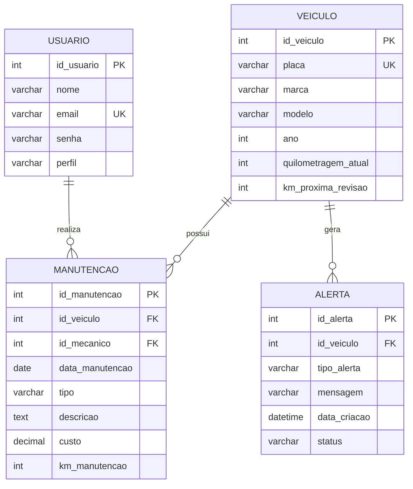

# 2. DER – Diagrama Entidade-Relacionamento (Modelo de Dados)

O modelo de dados a seguir descreve as entidades e os relacionamentos necessários para o sistema de controle de manutenção, focando em veículos, usuários, manutenções e alertas.

## Entidades e Atributos

| Entidade | Atributo | Tipo de Dado | Descrição | Restrições |
| :--- | :--- | :--- | :--- | :--- |
| **USUARIO** | `id_usuario` | INT | Chave primária | PK, Auto Incremento |
| | `nome` | VARCHAR(100) | Nome completo do usuário | NOT NULL |
| | `email` | VARCHAR(100) | E-mail para login | NOT NULL, UNIQUE |
| | `senha` | VARCHAR(255) | Senha criptografada | NOT NULL |
| | `perfil` | VARCHAR(20) | Nível de acesso (Admin, Mecânico, Motorista) | NOT NULL |
| **VEICULO** | `id_veiculo` | INT | Chave primária | PK, Auto Incremento |
| | `placa` | VARCHAR(10) | Placa do veículo | NOT NULL, UNIQUE |
| | `marca` | VARCHAR(50) | Marca do veículo | NOT NULL |
| | `modelo` | VARCHAR(50) | Modelo do veículo | NOT NULL |
| | `ano` | INT | Ano de fabricação | NOT NULL |
| | `quilometragem_atual` | INT | Quilometragem atual do veículo | NOT NULL |
| | `km_proxima_revisao` | INT | Quilometragem programada para a próxima manutenção preventiva | NOT NULL |
| **MANUTENCAO** | `id_manutencao` | INT | Chave primária | PK, Auto Incremento |
| | `id_veiculo` | INT | Chave estrangeira para VEICULO | FK |
| | `id_mecanico` | INT | Chave estrangeira para USUARIO (Mecânico) | FK |
| | `data_manutencao` | DATE | Data em que a manutenção foi realizada | NOT NULL |
| | `tipo` | VARCHAR(20) | Tipo de manutenção (Preventiva, Corretiva) | NOT NULL |
| | `descricao` | TEXT | Detalhes do serviço realizado/problema corrigido | NOT NULL |
| | `custo` | DECIMAL(10, 2) | Custo total da manutenção | NOT NULL |
| | `km_manutencao` | INT | Quilometragem do veículo no momento da manutenção | NOT NULL |
| **ALERTA** | `id_alerta` | INT | Chave primária | PK, Auto Incremento |
| | `id_veiculo` | INT | Chave estrangeira para VEICULO | FK |
| | `tipo_alerta` | VARCHAR(50) | Tipo de alerta (Próxima Revisão, Pneu Vencido, etc.) | NOT NULL |
| | `mensagem` | VARCHAR(255) | Mensagem detalhada do alerta | NOT NULL |
| | `data_criacao` | DATETIME | Data e hora da criação do alerta | NOT NULL |
| | `status` | VARCHAR(20) | Status do alerta (Ativo, Resolvido) | NOT NULL |

## Relacionamentos

| Relacionamento | Entidade 1 | Cardinalidade 1 | Entidade 2 | Cardinalidade 2 | Descrição |
| :--- | :--- | :--- | :--- | :--- | :--- |
| **Realiza** | USUARIO | 1 | MANUTENCAO | N | Um Mecânico (USUARIO) realiza N Manutenções. |
| **Possui** | VEICULO | 1 | MANUTENCAO | N | Um VEICULO possui N Manutenções. |
| **Gera** | VEICULO | 1 | ALERTA | N | Um VEICULO pode gerar N Alertas. |

## Diagrama (Descrição Textual)

